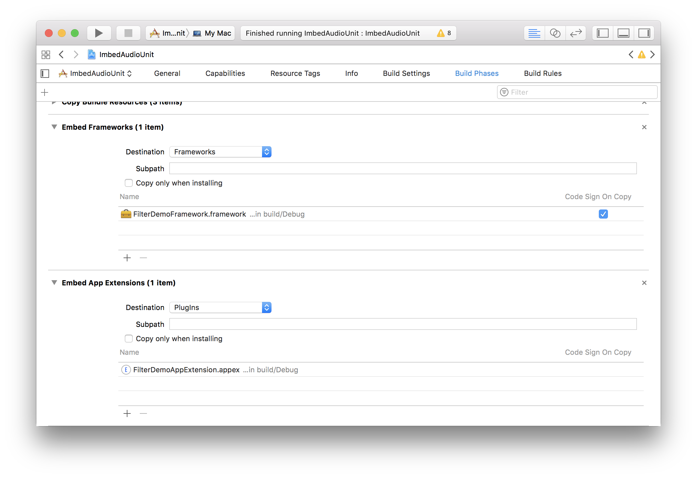
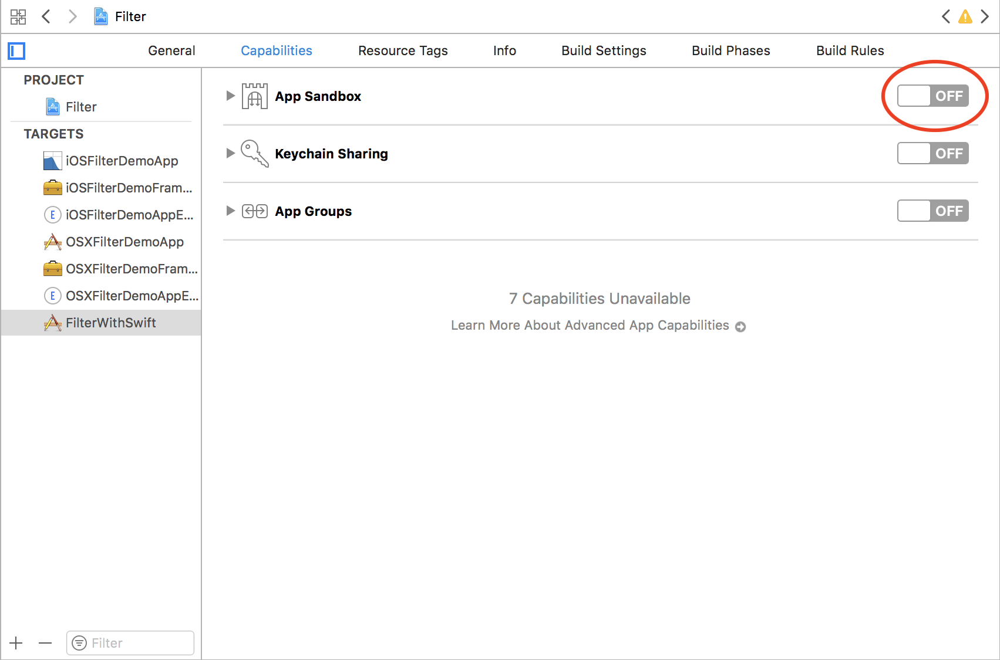
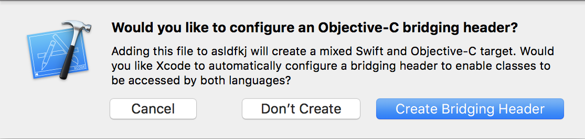

# Embedding an Audio Unit in an Application
Examples of embedding AUV3s in an app

---

## Contents
* [Swift-ifying](#swift-ifying)

---

### Structure

For each example, the structure is the same. For embedding the Audio Unit, a framework target is created that contains that the contents of the main Audio DSP as well as the Nib for the plug-in view. The app extension creates the audio unit factory and registers an audio unit with the given component description, see `FilterDemoViewController+AUAudioUnitFactory.m` line 15.

If recreating you will need to make sure the relevant frameworks have been embedded

Sandbox mode will also need to be disabled in order for the [registered audio unit to actually load](https://github.com/AudioKit/AudioKit/issues/1415).

---

## Swift-ifying

[Apple's AUV3 example code](https://developer.apple.com/library/archive/samplecode/AudioUnitV3Example/Introduction/Intro.html#//apple_ref/doc/uid/TP40016185) is an odd beast that still uses Objective-C for the interface side of the macOS Application examples. If there is one thing I hate more than Javascript, it's Objective-C. I was looking to understand more of how to put an Audio Unit into an application so this seemed like a perfect opportunity to port over the code.

---

### MixedSwiftObjC

This example simply translates over the main app interface but has left the underlying objective-c of the Audio Unit view controller untouched.
To ensure that everything compiles and Swift will see the Objective-C based framework. A bridge header is created in the main app target. If you created a Swift project and try to create a new Objective-C file you should be treated to following dialog. Select "Create Bridging Header"

All that should need to be changed are the FilterDSPFile contents and the Nib to match your parameters.

---
